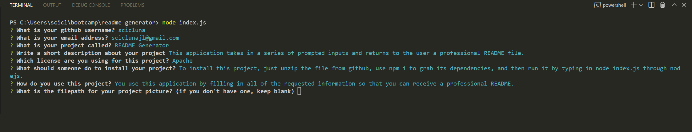

# README Generator

## Description

This application takes in a series of prompted inputs and returns to the user a professional README file.

## Table of Contents

- [Installation](#installation)
- [Usage](#usage)
- [Credits](#credits)
- [License](#license)
- [Contributions](#contributions)
- [Tests](#tests)
- [Questions](#questions)

## Installation

To install this project, just unzip the file from github, use npm i to grab its dependencies, and then run it by typing in node index.js through nodejs.

## Usage

You use this application by filling in all of the requested information so that you can receive a professional README.

## Credits

Jacob Jeffries

## License

This application is covered under the MIT license. Read more at [License: MIT](https://opensource.org/licenses/MIT)

## Contributions

Anyone can feel free to fork this project and make additions/contribute to this project. Just send me a pull request on github with the details of your changes and I would be glad to speak to you about them.

## Tests

By running npm test

## Questions

1. Where can I find your github so that I can view your other projects? https://github.com/scicluna

2. What email address should I use to contact you regarding further opportunities or questions? sciclunajl@gmail.com
